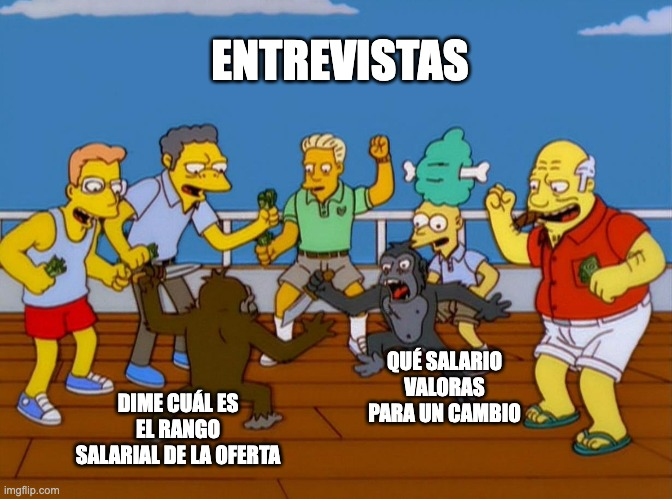
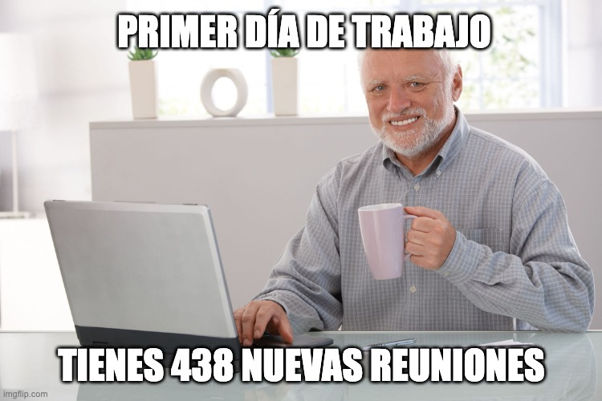

## LVL.01 - Preguntas básicas

Las preguntas que listo a continuación no deberían formar parte del proceso de entrevistas sino de la descripción de la oferta a la que uno se presenta. Si me apuráis, debería haber legislación al respecto para que estos datos sean parte obligatoria en la descripción de cualquier empleo.

> - **Modo**: ¿Presencial, híbrido, teletrabajo, trabajo remoto?
> - **Salario**: ¿Cúal es el rango salarial de la oferta? ¿Hay bonificaciones variables?
> - **Vacaciones**: ¿Cuántos días de vacaciones ofrece la empresa? ¿Hay días especiales de vacaciones: cumpleaños, nochebuena y/o nochevieja, libre disposición, conciliación?
> - **Beneficios**: ¿Formación, seguro médico, ticket restaurante, clases de inglés, presupuesto para trabajo remoto, asistencia a eventos IT, otros?

Mención especial a las ofertas con rangos salariales amplísimos o con valores indeterminados del tipo "según valía". No recomiendo aceptar una respuesta de este tipo ya que se podría considerar una falta de respeto a vuestro interés por la oferta o a vuestro tiempo libre. Y por experiencia, no seáis los primeros en comunicar expectativas salariales en el caso de no contar con esa información.

## LVL.02 - ¿Cómo es el trabajo en el día a día?

En el siguiente nivel es fundamental entender el día a día en el posible nuevo puesto de trabajo, así como conocer cuestiones básicas del funcionamiento de la empresa. Comenzar a trabajar en un lugar nuevo nos lleva a tratar con nuevas personas y forjar relaciones entre diferentes departamentos, por ello los flujos de comunicación son determinantes.

> - **Horario**: ¿Cuál es el horario de trabajo más habitual? ¿Se realizan horarios especiales intensivos: viernes, meses de verano, navidad?
> - **Día de trabajo**: ¿Podrías describir como sería un día típico trabajando en el proyecto (reuniones, tiempo de foco para trabajar)?
> - **Onboarding**: ¿Cómo será mi proceso de _onboarding_?
> - **Evolución y responsabilidades**: ¿Qué esperáis de la persona que opte al puesto que estáis ofertando? ¿Cuál es la evolución óptima que manejáis?
> - **Otros equipos**: ¿Se dispone de un equipo de sistemas / plataforma / QA / incidencias independiente? ¿Tenéis roles transversales en tecnología (_engineering manager_, _solutions architect_, ...)?
> - **Retos empresa**: ¿Cuál es el reto actual más importante al que se enfrenta el equipo / departamento / empresa?
> - **Eventos**: ¿Hay reuniones recurrentes del tipo _'company meeting'_ o _'team building'_? ¿Cómo suelen ser? ¿Con qué periodicidad? ¿Se pueden rechazar?
> - **Viajes**: ¿Se hace cargo la empresa de los gastos y la reserva de transporte/alojamiento cuando hay que viajar?

Con este bloque de peguntas pretendo conocer cómo de engrasada está la maquinaria burocrática. Cuesta aceptar a veces que determinados problemas de productividad nacen de procesos extremadamente tediosos o poco afinados, exceso de reuniones o _micro-management_. A este respecto la [Ley de Conway](https://es.wikipedia.org/wiki/Ley_de_Conway) sigue plenamente vigente.

## LVL.03 - Descubre aquello que no te quieren contar

En este último bloque me reservo un conjunto de preguntas algo más controvertidas que en muchos casos las empresas ofertantes de empleo suelen 'evitar'. Como asistente a numerosos eventos del sector IT uno siempre encuentra que las compañías promocionan aquello de lo que se sienten orgullosas pero omiten deliberadamente información muy importante que puede llegar a impactar directamente en tu calidad de vida. De nada sirve que anuncies a bombo y platillo tus 7 clústers de Kubernetes si después tus empleados tienen equipos informáticos con 4GB de RAM o si van a recibir 5 llamadas cada madrugada cuando estén de _oncall_.

> - **Guardias**: ¿Hay guardias? ¿Activas o pasivas? ¿Con qué periodicidad? ¿Cuál es la compensación extra por realizarlas? ¿Cuántas incidencias se notifican de media por semana / mes?
> - **Hardware**: ¿Cuáles son las herramientas _hardware_ para trabajar? ¿Se trabaja a través de un equipo compartido? ¿Se dispone de sistemas como VPN o SSO?
> - **Software**: ¿Cuáles son las licencias _software_ de servicios o herramientas (IntelliJ, Postman, etc) que utilizáis en el día a día?
> - **Rotación y promoción**: ¿Cuál es la antigüedad media de los miembros en plantilla o en el equipo? ¿Disponéis de planes de movilidad interna dentro de la empresa? ¿Cómo funcionan los procesos de promoción?
> - **Obsevabilidad**: ¿Qué software de observabilidad tenéis? ¿Qué métricas manejáis en el día a día?
> - **Estrategia/planificación**: ¿Quién decide o prioriza la estrategia de negocio? ¿Cada cuánto cambia o se re-analiza? ¿_North Star_ para el equipo / departamento / compañía?
> - **Outboarding**: ¿Tenéis proceso de _outboarding_? ¿Cómo gestionáis la marcha de empleados?
> - **Documentación**: ¿Cuál es vuestra estrategia de documentación? ¿Cómo os aseguráis de que el conocimiento se comparte y llega a diferentes áreas de la empresa? ¿Cuidáis vuestro lenguaje ubicuo? ¿Cómo lucháis contra los silos de información?
> - **Cultura de equipo**: Estrategia de _testing_ / _branching model_, tiempo de formación o mejora continua, _feedback_ interno, plan de carrera.

Por experiencia, muchas de estas preguntas descolocan y derivan en situaciones tensas e incluso desagradables durante las entrevistas. Mi objetivo es que manejéis ejemplos sobre qué preguntar cuando tengáis dudas fundadas en algún aspecto clave. En mi humilde opinión, habiendo estado en ambos lados de un proceso de contratación, la formulación de preguntas denota interés por el puesto y nunca debría ser considerada un ataque.

## En resumen

Una entrevista debería ser algo así como una conversación amistosa entre dos partes interesadas en compartir un futuro laboral. En dicho proceso es fundamental hacer preguntas para conocer detalles sobre el puesto que te están ofertando.

Mi recomendación es que te prepares intentando conocer información básica de la empresa para la que te postulas y que seas honesto y cercano durante las entrevistas. No te olvides tampoco de tomar notas sobre todo lo que te compartan en las diferentes fases de un proceso de selección.

Y cuando llege ese momento de _"¿Tienes alguna pregunta para nosotros?"_, ya sabes lo que hacer. Pregunta.
